# 📚 Library System Documentation

## 1. Public Lihat Buku
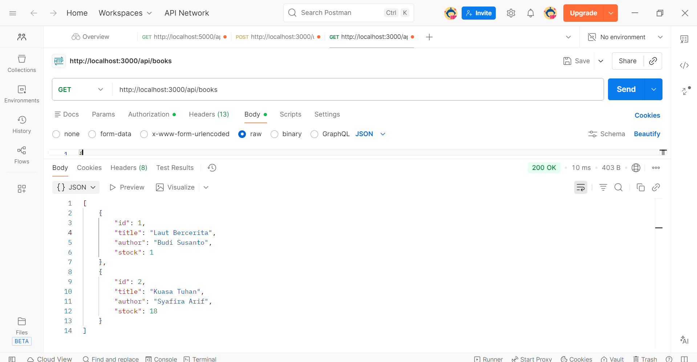

## 2. Lihat Buku By ID
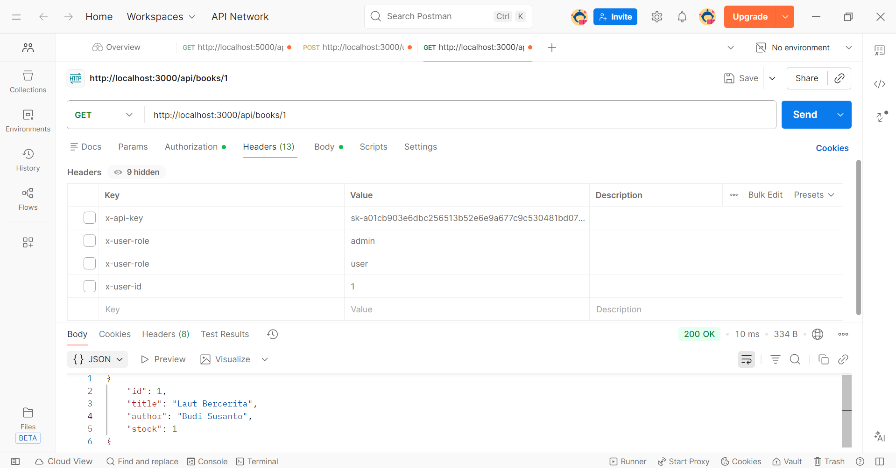

## 3. Tambah Buku
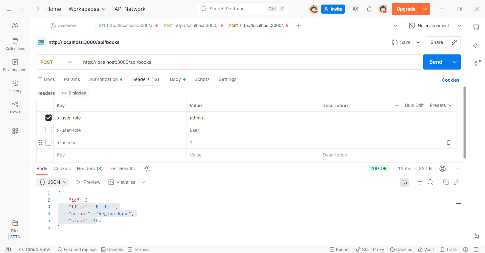

## 4. Edit Buku

## 5. Hapus Buku
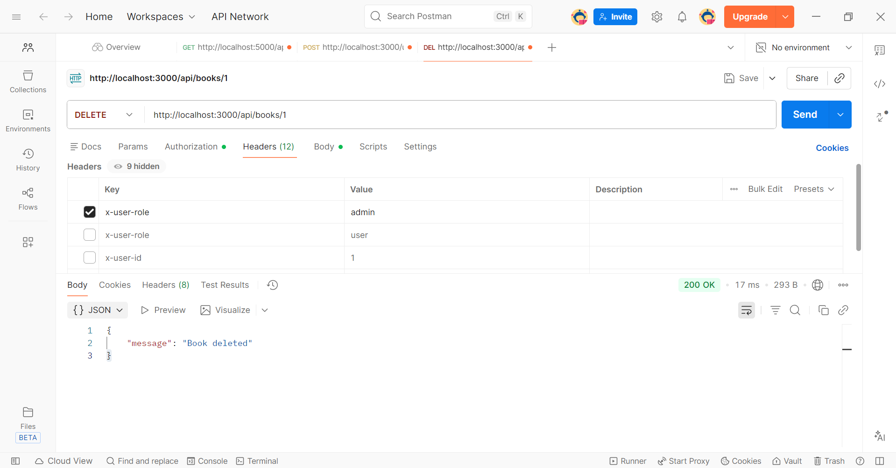

## 6. User Pinjam Buku
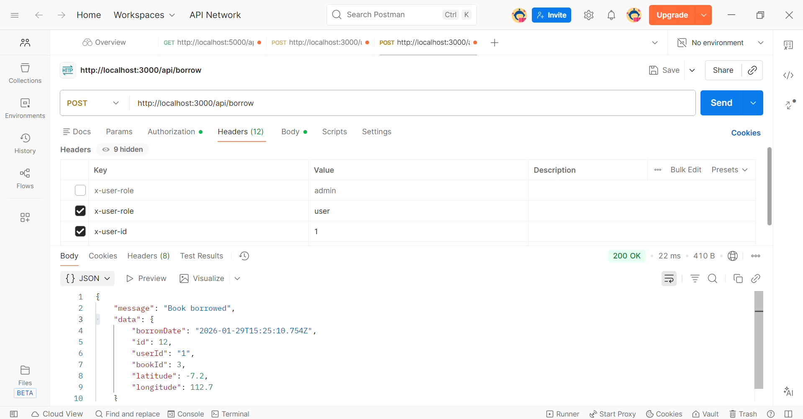

## 7. Setelah Buku Dipinjam
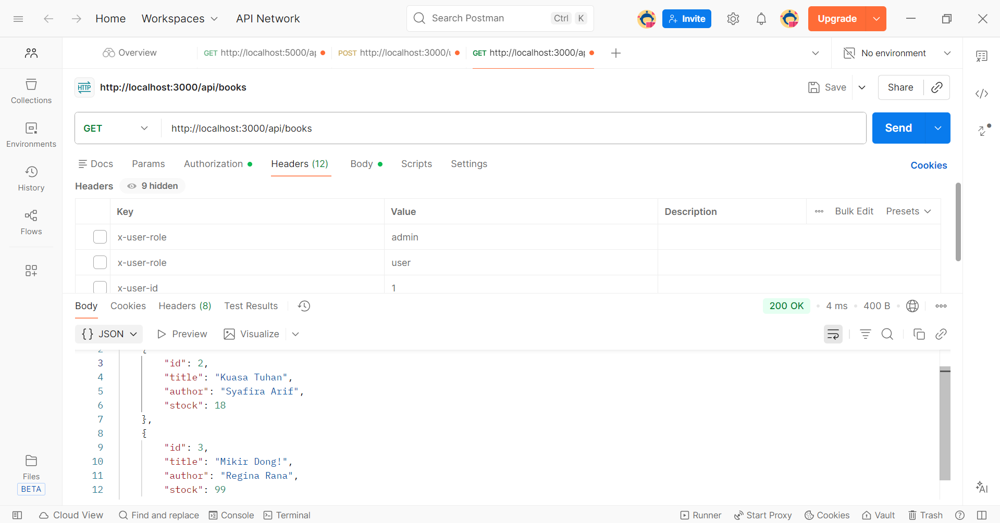

## 8. Akses User Ditolak
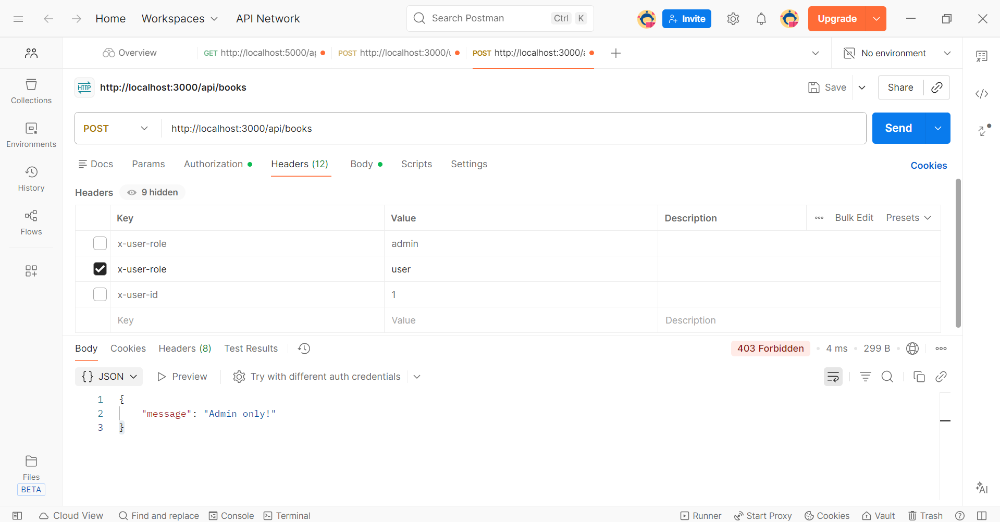

## 9. Lihat Semua Buku
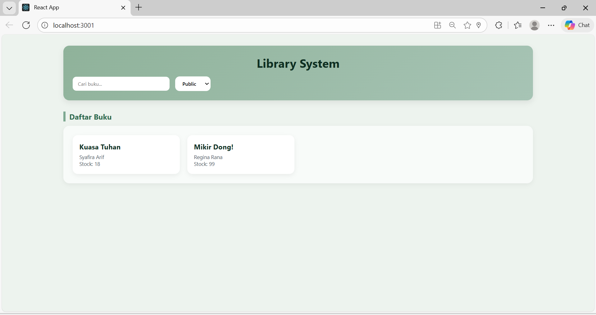

## 10. Lihat 1 Buku
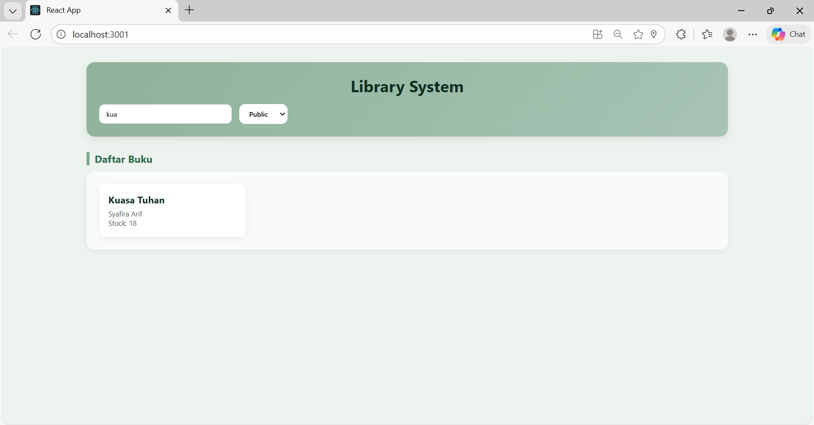

## 11. Tambah Buku (Admin)
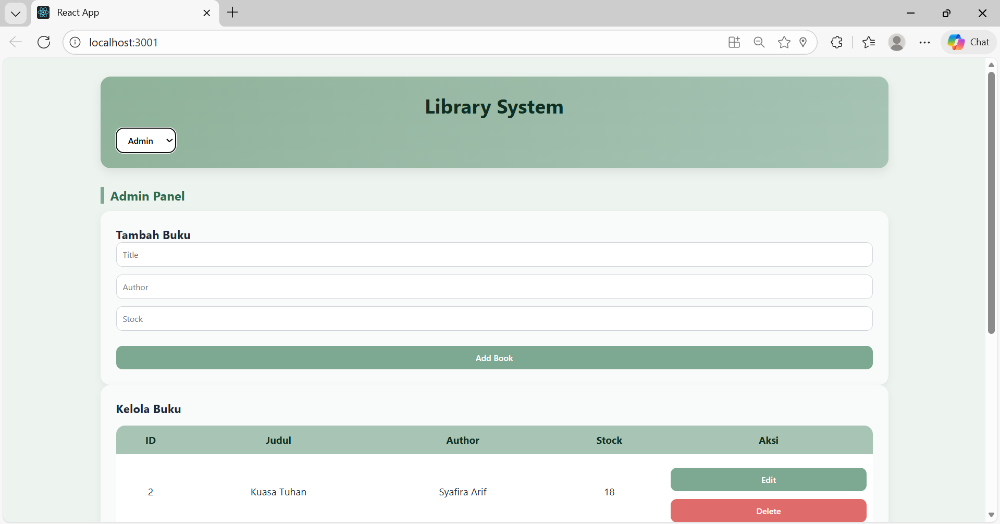

## 12. Edit, Hapus, dan Borrow Buku
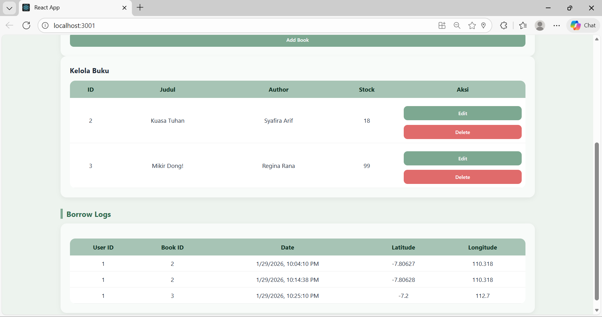

## 13. UI User Pinjam Buku
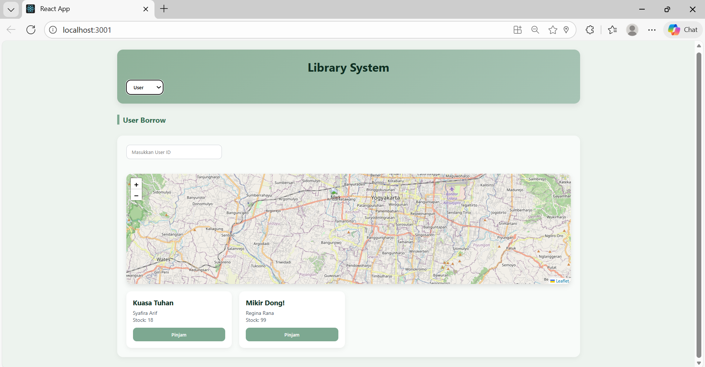

## 14. Database Buku
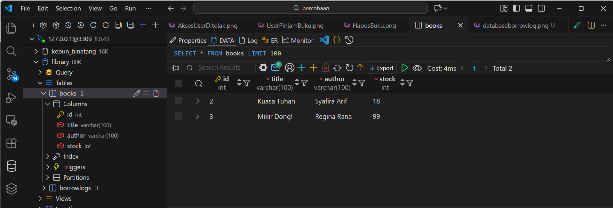

## 15. Database Borrow Log
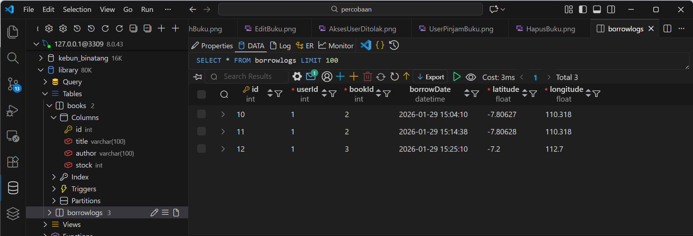

